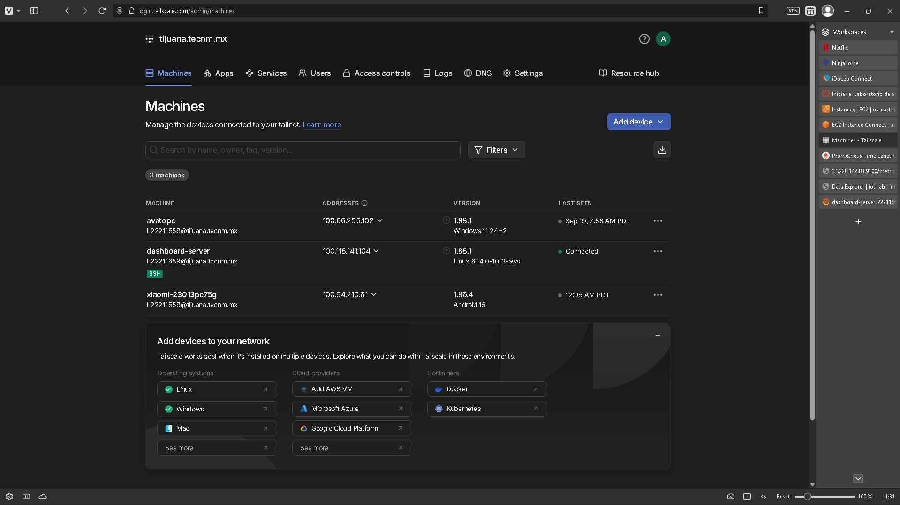
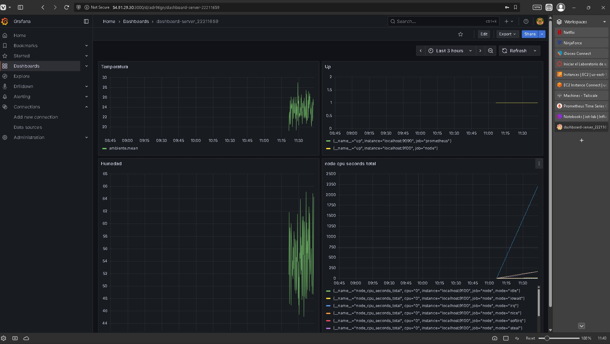

# Sanchez Ruano Alexis Sebastian IoT Stack

1. Captura de pantalla del panel de administración de Tailscale mostrando el nodo dashboard-server.



2. Dashboard de Grafana donde se visualicen los datos de InfluxDB y las métricas de Prometheus.



3. Código Python utilizado para la simulación de datos.

```
from datetime import datetime
import random
import time
from influxdb_client import InfluxDBClient, Point, WritePrecision

token = "Fj01z7hXj9E5LxnrVspbQk7UTnUhpKrPfpWrDZrpBd5Ai_-CWnPjBPgVWAVJHfhSXcia2at4hH3hqEeOxXhd-w=="
org = "iot-lab"
bucket = "sensores"

client = InfluxDBClient(url="http://localhost:8086", token=token, org=org)
write_api = client.write_api()

while True:
    temp = random.uniform(18, 30)
    hum = random.uniform(40, 70)
    point = (
        Point("ambiente")
        .tag("ubicacion", "laboratorio")
        .field("temperatura", temp)
        .field("humedad", hum)
        .time(datetime.utcnow(), WritePrecision.NS)
    )
    write_api.write(bucket=bucket, record=point)
    print(f"Enviado: temp={temp:.2f}, hum={hum:.2f}")
    time.sleep(5)
```

4. ¿Por qué es útil Tailscale en este escenario?.

Tailscale permite mantener una IP fija dentro de una red interna sin necesidada de abrir puertos, facilitando su uso enormemente.

5. Diferencia entre las métricas de IoT (InfluxDB) y las métricas de sistema (Prometheus/Node Exporter).

Las diferencias son claras desde su concepción: IoT son más libres al medirse de más maneras como lo son los sensores por dar un ejemplo aunque estos sean simulados, mientras que prometheus mide más las funciones internas como el sistema, el uso y otros aspectos como el tiempo de uso.
